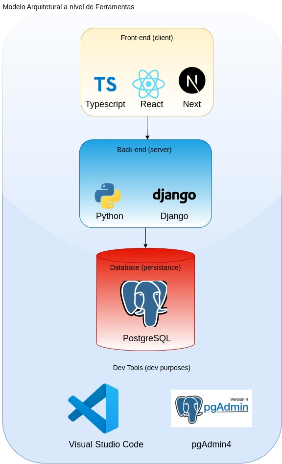
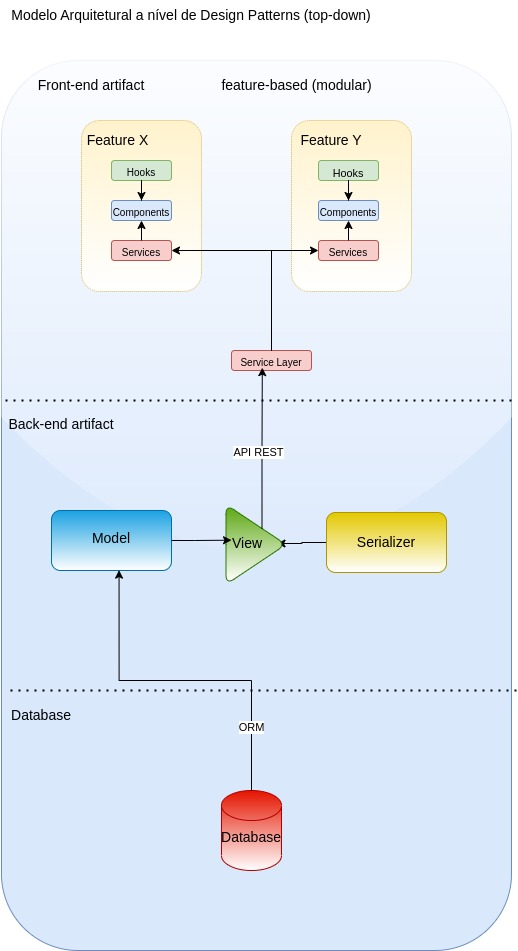

# 🚀 Sistema de Gestão de Tarefas
 
## 📌 Matriz de Requisitos
### 🎯  Objetivo
Gerar uma planilha detalhada contendo:
- **Requisitos Funcionais (RF):** Funcionalidades que o sistema deve oferecer para atender às necessidades do usuário.
- **Requisitos Não Funcionais (RNF):** Características que definem restrições ou qualidades do sistema, como segurança, desempenho, escalabilidade e usabilidade.

### 🏗️ Descrição 
A matriz de requisitos tem como propósito proporcionar uma visão detalhada dos requisitos do sistema, permitindo uma melhor compreensão e alinhamento entre os stakeholders. A imersão nesse processo visa garantir que todas as necessidades do sistema sejam documentadas e classificadas corretamente.

### 📜 Resultado 
✅ https://docs.google.com/spreadsheets/d/1yYjmzwWoPQEXNeHCpLPaztU0F_QB1FHULPFtVzqQRCg/edit?usp=drivesdk

---

## 📌 Diagrama de Casos de Uso
### 🎯 Objetivo
Mapear os requisitos funcionais em casos de uso, identificando os atores e seus relacionamentos.

### 🏗️ Descrição
O diagrama de casos de uso servirá como uma representação visual das interações dos usuários com o sistema, permitindo um melhor entendimento das funcionalidades esperadas. A definição dos atores e seus relacionamentos ajuda na estruturação dos fluxos principais e alternativos, garantindo que todos os cenários sejam contemplados antes do desenvolvimento.

### 📜 Resultado

Referência: [HERE](https://drive.google.com/file/d/1G0ASWGfHC9LwzlMKUKj1P6tQT36Ttk-R/view?usp=sharing)

---

## 📌 Desenhos Arquiteturais
### 🎯 Objetivo
Definir a visão de camadas de ferramentas e padrões de projeto que serão utilizados no desenvolvimento do sistema.

### 🏗️ Descrição
Os desenhos arquiteturais representam a estrutura do sistema em diferentes níveis:
- **Visão de Camadas de Ferramentas:** Organização dos componentes do sistema, separando responsabilidades entre back-end, front-end, banco de dados e serviços externos.
- **Visão de Camadas de Padrões de Projeto:** Uso de boas práticas de design de software para garantir um código modular, reutilizável e de fácil manutenção.

Principais conceitos abordados:
- **MVC (Model-View-Controller)** no Django
- **Arquitetura baseada em componentes** no Next.js (React/TypeScript)
- **RESTful API e comunicação entre serviços**

### 📜 Resultado

**Visão de Camadas de Ferramentas:**

Referencia: [Here](https://drive.google.com/file/d/14MJlVH2kfbPF1Wq-PdXQGgUWIRlJXR1Z/view?usp=sharing)

**Visão de Camadas de Padrões de Projeto:**

Referencia: [Here](https://drive.google.com/file/d/1F_oUw0ZNWFO2L5j2ztnevedhOZMdENYT/view?usp=sharing)

ORM: ORM (Object-Relational Mapping) é um padrão que mapeia classes Python para tabelas do banco de dados. No Django, ele permite interagir com o banco relacional usando código Python em vez de SQL. Isso simplifica operações como criar, ler, atualizar e deletar dados.

MVS: MVS (Model-View-Serializer) é um padrão usado no Django REST Framework. O Model representa a estrutura dos dados, o View trata as requisições e o Serializer converte os dados entre JSON e objetos Python. Juntos, permitem criar APIs de forma rápida e organizada.

API REST: O padrão REST define regras para criar APIs que usam HTTP para comunicação. Ele organiza os recursos da aplicação em endpoints com métodos como GET, POST, PUT e DELETE. É simples, escalável e amplamente usado em sistemas web.

Service Layer: O padrão Service Layer centraliza a lógica de negócios em classes de serviço, separando-a das views e dos models. Isso organiza melhor o código, facilita testes e reaproveitamento. É útil em projetos com regras complexas ou múltiplas fontes de dados.

Feature-based: o padrão Feature Based organiza os arquivos por funcionalidades (features) em vez de tipos (como separar todos os componentes ou páginas). Cada pasta representa uma feature e contém seus próprios componentes, hooks, estilos e testes. Isso torna o projeto mais modular, escalável e fácil de manter.

---

## 📌 Protótipos Navegáveis
### 🎯 Objetivo
Criar um fluxo navegável utilizando protótipos interativos na ferramenta **Figma**.

### 🏗️ Descrição
O uso de protótipos navegáveis permite testar a experiência do usuário antes da implementação, validando a usabilidade e a disposição dos elementos na interface. A criação do fluxo navegável envolve:
1. **Wireframes de baixa fidelidade:** Esboços iniciais das telas.
2. **Protótipos de alta fidelidade:** Interfaces próximas da versão final do sistema.
3. **Interações e transições:** Simulação de navegação entre as telas.

### 📜 Resultado
[Workspace](https://www.figma.com/design/Nflh2VV3d03zD9NitOLNxy/Prototipos---tarefas?node-id=2-2&p=f&t=UNsZltgTjY2MN32A-0)

[Navegável](https://www.figma.com/proto/Nflh2VV3d03zD9NitOLNxy/Prototipos-tarefas?node-id=2-2&p=f&t=UNsZltgTjY2MN32A-0&scaling=min-zoom&content-scaling=fixed&page-id=2%3A2&starting-point-node-id=18%3A6&show-proto-sidebar=1)

---

## 📌 Desenvolvimento com Agile Methods - Scrum
### 🏗️ Descrição
O desenvolvimento do sistema será conduzido com a metodologia **Scrum**, garantindo entregas incrementais e alinhamento contínuo com os stakeholders.

### 🔄 Principais práticas adotadas:
- **Backlog Refinement:** Priorização das funcionalidades a serem desenvolvidas.
- **Sprint Planning:** Planejamento de cada ciclo de desenvolvimento.
- **Daily Stand-up:** Reuniões diárias para acompanhamento do progresso.
- **Sprint Review & Retrospective:** Avaliação do trabalho concluído e melhoria contínua do processo.

## 🔧 Tecnologias Utilizadas
O desenvolvimento será realizado com um stack moderno e eficiente:
- **Back-end:** Python com Django
- **Front-end:** React com TypeScript (Next.js)
- **Banco de Dados:** PostgreSQL
- **Versionamento de Código:** Git/GitHub
- **Gerenciamento de Projetos:** ⏳ TODO

### 📜 Resultado
[Link para o Back-end](https://github.com/peddro1/BackEnd_SISGETASK)

>>>>>>> 8c40e63014cece03991924bd48a5fda1ebfd76ac
